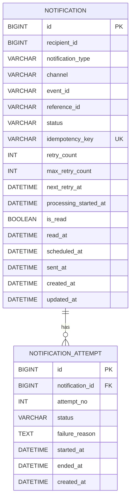

# ERD



## 상태 전이

```
PENDING → SENDING → SENT
PENDING → SENDING → FAILED → SENDING → SENT
PENDING → SENDING → FAILED → ... → DEAD
```

| 상태 | 설명 |
|---|---|
| PENDING | 발송 대기 |
| SENDING | 처리 중 |
| SENT | 발송 완료 |
| FAILED | 실패 (재시도 대기) |
| DEAD | 최종 실패 (재시도 횟수 초과) |

## 테이블 관계

- `NOTIFICATION` 1개에 `NOTIFICATION_ATTEMPT` 여러 개 (1:N)
- 발송 시도마다 `NOTIFICATION_ATTEMPT`에 이력이 쌓임
- `idempotency_key` UNIQUE 제약으로 중복 발송 방지
